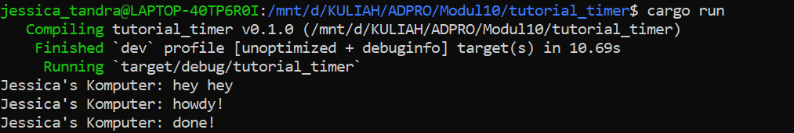
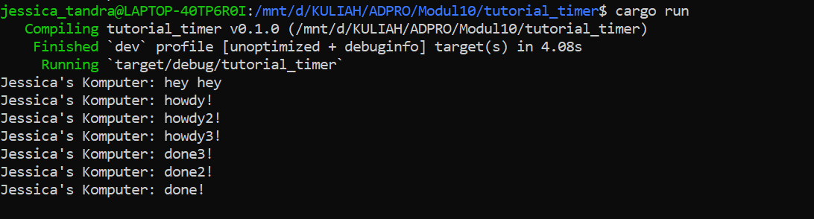
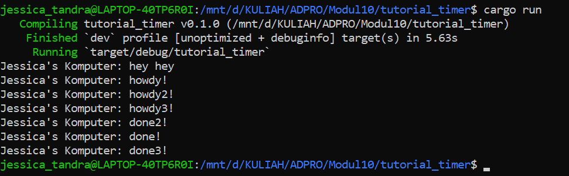

# Advanced Programming - Module 10
**Asynchronous Programming**

## Experiment 1.2: Understanding how it works

### Hasil Eksekusi

Setelah baris `println!("Jessica's Komputer: hey hey");` ditambahkan di luar blok `spawner.spawn`, urutan teks yang dicetak di terminal berubah menjadi:
1. `Jessica's Komputer: hey hey`
2. `Jessica's Komputer: howdy!`
3. *(jeda 2 detik)*
4. `Jessica's Komputer: done!`

Hal ini terjadi karena fungsi `spawner.spawn(...)` tidak langsung menjalankan *future* atau *task* pada saat itu juga. Fungsi tersebut hanya bertugas membuat sebuah *task* baru dan memasukkannya (*enqueue*) ke dalam *channel* milik *executor* agar siap dieksekusi nanti.

Karena *task* tersebut tidak langsung dijalankan (sifat *lazy* pada Rust Future), *thread* utama (*main thread*) akan terus melanjutkan eksekusi ke baris kode berikutnya secara sinkron. Oleh karena itu, program langsung mengeksekusi `println!("Jessica's Komputer: hey hey");` yang berada di bawahnya. 

*Task* *asynchronous* yang berisi `howdy!` dan `done!` baru benar-benar dieksekusi (di-*poll*) ketika program memanggil fungsi `executor.run()` di baris paling akhir. Saat `executor.run()` dipanggil, program mulai mengambil *task* dari antrean dan menjalankannya, sehingga `howdy!` tercetak, kemudian *task* tersebut ditunda (*yield*) selama 2 detik oleh `TimerFuture`, dan akhirnya diselesaikan dengan mencetak `done!`.

## Experiment 1.3: Multiple Spawn and removing drop

**1. Apa efek dari Multiple Spawn?**
Ketika kita melakukan *multiple spawn*, kita menambahkan beberapa *task* sekaligus ke dalam *task sender* (antrean). Saat `executor.run()` dipanggil, executor akan mengeksekusi (*poll*) *task* tersebut satu per satu. Karena setiap *task* memiliki `TimerFuture::new(Duration::new(2, 0)).await`, *task* tersebut akan di-*yield* (mengembalikan `Poll::Pending`) dan executor langsung berpindah untuk mengeksekusi *task* berikutnya. Inilah sebabnya semua teks `howdy` tercetak hampir secara instan secara berurutan. Setelah 2 detik, sistem *waker* akan membangunkan semua *task* tersebut secara bersamaan, sehingga semua teks `done` juga tercetak bersamaan. Ini menunjukkan bagaimana *asynchronous programming* menjalankan *task* secara konkuren pada satu *thread*.

**2. Apa yang terjadi jika `drop(spawner)` dihapus?**
Jika `drop(spawner)` dihapus atau di-comment, program tidak akan pernah berhenti (hang) dan kita harus mematikannya secara paksa (`Ctrl+C`). Hal ini terjadi karena `Executor` menjalankan *loop* `while let Ok(task) = self.ready_queue.recv()` yang akan terus mendengarkan (listen) *channel* untuk *task* baru. *Loop* ini hanya akan berhenti menerima pesan dan keluar jika *channel* ditutup. *Channel* di Rust otomatis tertutup jika semua *Sender* (dalam hal ini `spawner`) di-drop. Karena `spawner` tidak di-drop, *executor* mengira masih akan ada *task* baru yang masuk, sehingga ia menunggu (*blocking*) selamanya.

### Tanpa `drop`

### Dengan `drop`
